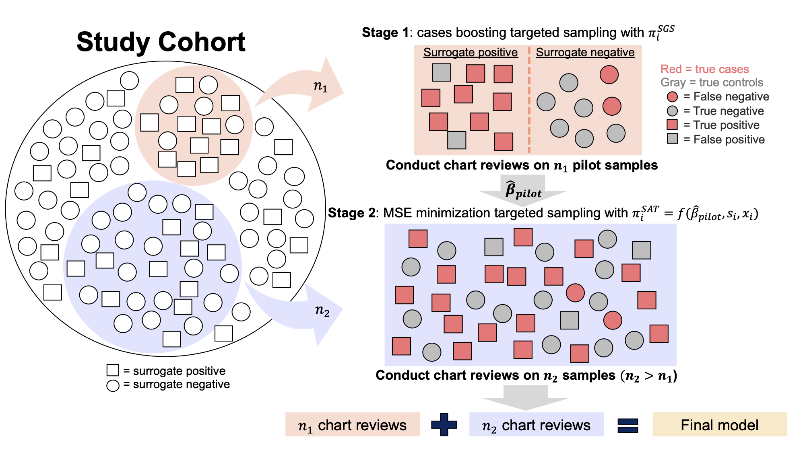

# SAT: a Surrogate Assisted Two-wave case boosting sampling method


## Outline

1. Description 
2. SAT workflow
3. Package requirements

## Description

This README is prepared for journal peer review of the surrogate assisted two-wave (SAT) case boosting sampling method paper. SAT is proposed to simultaneously solve two commonly co-existing issues in Electronic health records (EHR) based association studies, i.e., the bias in association estimation brought by potentially error-prone EHR-derived phenotypes (i.e., surrogates) and the efficiency loss caused by low prevalence phenotypes (e.g., rare disease). Target on improving estimation accuracy, SAT selects a subsample for outcome validation through manual chart review subject to budget constraints, and a model is then fitted based on the subsample.

To demonstrate its usage, in this repository we provide the codes to implement the method and reproduce the simulation results displayed in the paper. This README also introduces a simple example to implement SAT.  


## SAT Workflow


At stage 1, for enriching cases we apply surrogate-guided sampling (SGS) to obtain a pilot subsample of size $n_1$, for which we collect the true phenotypes and use them to obtain a pilot estimator for the association parameter. At stage 2, based on the pilot estimator, the covariates, and the surrogate phenotype, we compute the SAT sampling probabilities which target controlling MSE and apply them to obtain the second-stage subsample of size $n_2$, for which the true phenotypes are collected. The final estimator is obtained by fitting a weighted logistic regression in the pooled subsample of size $n_1+n_2$ with their true phenotypes.

## Run SAT example 
What we need:
1. A dataset including risk factors and surrogates for the full cohort;
2. R software;
3. Download and install R package [OSMAC](https://www.tandfonline.com/doi/suppl/10.1080/01621459.2017.1292914?scroll=top). Note: you can find the package in the supplementary material of the [OSMAC paper](https://www.tandfonline.com/doi/full/10.1080/01621459.2017.1292914?scroll=top&needAccess=true). For simplicity, here we directly copy the two main functions from `OSMAC` to a file `OSMAC_functions.R`.


Step 1: load the related R packages and prepare sample data

```{r}
rm(list=ls())
library(mvtnorm)
#library(OSMAC)
source("OSMAC_functions.R")
set.seed(0)


n <- 1e5    # sample size of the full cohort
r1 <- 300   # 1st stage subsample size
r <- 800    # 2nd stage subsample size


## get a simulated dataset 
beta0  <- c(-1/2, 0, 0, rep(1/2, 5)) 
d <- length(beta0)
corr  <- 0.5
sigmax  <- matrix(corr, d-1, d-1) + diag(1-corr, d-1)
X <- rmvnorm(n, rep(-1.5, d-1), sigmax)
X <- cbind(1, X)
P  <- 1 - 1 / (1 + exp(X %*% beta0))
## generate Y for method illustration, in practice Y is not available 
Y  <- rbinom(n, 1, P)
print(mean(Y))


## generate surrogates 
a1 <- 0.85 # sensitivity
a2 <- 0.95 # specificity
pr_s <- vector(mode = "numeric", length = n)
pr_s <- a1*(Y==1) + (1-a2)*(Y==0)
S <- rbinom(n, 1, pr_s)
```
Till now, we've already got the required data to implement the proposed SAT method. Here we note that in practice the true phenotype $Y$ of the full cohort is not available. Next, we collect true phenotypes by manual chart review for the samples selected in the 1st stage and the 2nd stage subsampling procedures. 

Step 2: 1st stage subsampling
```{r}
## compute SGS sampling probabilities with R=0.5
pi_s1 <- 0.5*r1/mean(S)/n
pi_s0 <- 0.5*r1/(1-mean(S))/n
PI.prop <- pi_s1*(S==1) + pi_s0*(S==0)
PI.prop <- PI.prop/sum(PI.prop)

      
## 1st stage sampling get pilot sample
idx.prop <- sample(1:n, r1, T, PI.prop)
x.prop <- X[idx.prop, ]
y.prop <- Y[idx.prop] # in practice y.prop are collected by manual chart review
s.prop <- S[idx.prop]


## weighted estimation to get pilot estimator
pinv.prop <- 1/PI.prop[idx.prop]
fit.prop <- getMLE(x = x.prop, y = y.prop, w = pinv.prop)
beta.prop <- fit.prop$par
```


Stage 3: 2nd stage subsampling and final model fitting 
```{r}
## use pilot sample to compute n*r1*M_x
P.prop <- 1 - 1/(1 + exp(X %*% beta.prop))
p.prop <- P.prop[idx.prop]
w.prop <- p.prop * (1 - p.prop)
W.prop <- solve(t(x.prop) %*% (x.prop * w.prop * pinv.prop))      
      

#--------SAT-S--------#
      
## compute sampling probabilities with S and conduct 2nd subsampling
PI.mMSE.S <- sqrt((S - P.prop)^2 * rowSums((X %*% W.prop)^2))
PI.mMSE.S <- PI.mMSE.S/sum(PI.mMSE.S)
idx.mMSE <- sample(1:n, r, T, PI.mMSE.S)

## final model fitting with combined samples
x.mMSE <- X[c(idx.mMSE, idx.prop), ]
y.mMSE <- Y[c(idx.mMSE, idx.prop)]
pinv.mMSE <- c(1/PI.mMSE.S[idx.mMSE], pinv.prop)
fit.mMSE <- getMLE(x = x.mMSE, y = y.mMSE, w = pinv.mMSE)
fit.mMSE$message
fit.mMSE$par

      
      
      
#--------SAT-cY--------#

## compute E(Y|S) as P(Yi=1|Si=1) and P(Yi=1|Si=0)
a1.hat <- sum((s.prop[y.prop==1]==1))/sum(y.prop==1)
a2.hat <- sum((s.prop[y.prop==0]==0))/sum(y.prop==0)
condY <- pmin(a1.hat*P.prop/mean(S),1)
condY[S==0] <- pmin((1-a1.hat)*P.prop[S==0]/(1-mean(S)),1)


## compute sampling probabilities with E(Y|S) and conduct 2nd subsampling
PI.mMSE.cY <- sqrt((condY - P.prop)^2 * rowSums((X %*% W.prop)^2))
PI.mMSE.cY <- PI.mMSE.cY/sum(PI.mMSE.cY)
idx.mMSE <- sample(1:n, r, T, PI.mMSE.cY)

## final model fitting with combined samples
x.mMSE <- X[c(idx.mMSE, idx.prop), ]
y.mMSE <- Y[c(idx.mMSE, idx.prop)]
pinv.mMSE <- c(1/PI.mMSE.cY[idx.mMSE], pinv.prop)
fit.mMSE <- getMLE(x = x.mMSE, y = y.mMSE, w = pinv.mMSE)
fit.mMSE$message
fit.mMSE$par
```

